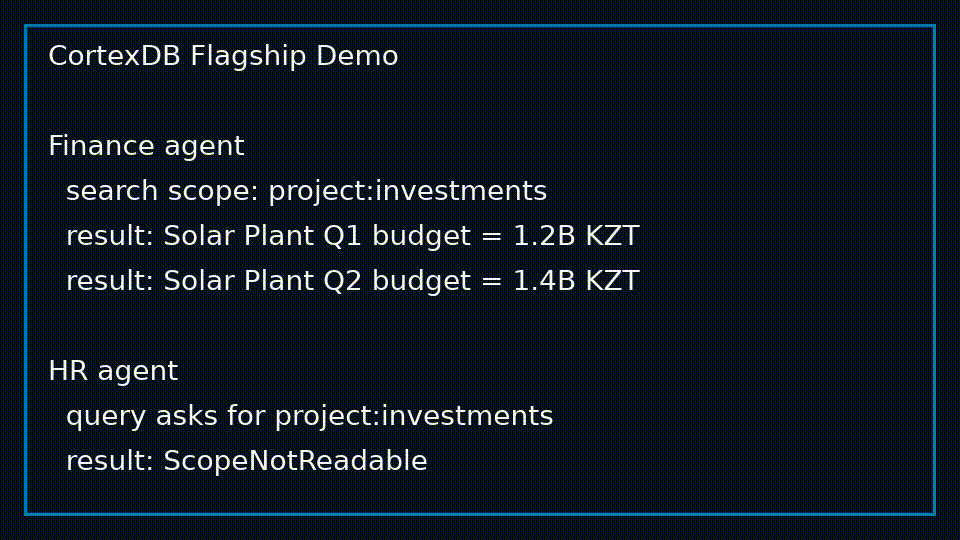

# CortexDB

[](https://github.com/AubakirovArman/CortexDB/actions/workflows/rust.yml)

**CortexDB is an experimental Core Alpha with Beta Foundation evidence for an agent-native context database.**

> ⚠️ **Warning:** CortexDB is currently in **Core Alpha status** and is suitable for local experiments, research, architecture validation, and early contributors. It is **not recommended for production workloads yet.**
>
> The current beta target is `v0.2.0-beta.1`: a local single-node developer/API
> beta. Promotion requires `make beta-release-check` and the evidence bundle
> described in [`docs/BETA_RELEASE.md`](docs/archive/BETA_RELEASE.md).

For the short external beta overview, start with
[`docs/BETA_LANDING.md`](docs/archive/BETA_LANDING.md).
For a copy-paste local path to the first ContextPack, start with
[`docs/GETTING_STARTED.md`](docs/GETTING_STARTED.md).
For runnable domain scenarios, see
[`docs/USE_CASE_PACKS.md`](docs/archive/USE_CASE_PACKS.md).
For public benchmark history, see
[`docs/PUBLIC_BENCHMARKS.md`](docs/archive/PUBLIC_BENCHMARKS.md).
For neutral comparison with adjacent stacks, see
[`docs/COMPARISONS.md`](docs/COMPARISONS.md).
For agent-memory TTL/feedback demo, see
[`examples/demo/agent_memory/README.md`](examples/demo/agent_memory/README.md).
For durable tool registry cells and ContextPack inclusion, see
[`docs/TOOL_REGISTRY.md`](docs/archive/TOOL_REGISTRY.md).
For typed entity/relation/source graph traversal, see
[`docs/KNOWLEDGE_GRAPH.md`](docs/archive/KNOWLEDGE_GRAPH.md).
For the knowledge cell, MVCC, scope, lifecycle, and metadata contract, see
[`docs/DATA_MODEL.md`](docs/DATA_MODEL.md).

CortexDB is specifically engineered for autonomous AI agents. Unlike traditional databases that return raw rows or tables, or vector databases that return fragmented, unverified text chunks, CortexDB compiles permission-safe, evidence-aware **Context Packs** with strict token-budget limits and deterministic fact verification.

---

## Public Benchmark Snapshot

Status: beta evidence, not a production or leaderboard claim.

CortexDB has a full local LongMemEval v1 run on the official cleaned
`longmemeval_s_cleaned.json` split:

| Benchmark | Result |
| --- | ---: |
| Official GPT-4o QA accuracy | `0.7660` |
| Correct answers | `383 / 500` |
| Session `recall_all@10` | `0.9021` |
| Session `ndcg_any@10` | `0.7873` |
| Generation prompt tokens | `14,213,801` |
| Generation completion tokens | `33,942` |

The run uses the official LongMemEval v1 data, official retrieval metric script,
official generation format, and official `evaluate_qa.py gpt-4o` evaluator.
Artifacts and packaging commands are documented in
[`docs/LONGMEMEVAL_OFFICIAL.md`](docs/archive/LONGMEMEVAL_OFFICIAL.md).

Current interpretation: CortexDB is not claiming SOTA. The result shows that a
beta-stage local context database can already run a real long-memory benchmark
end-to-end with reproducible artifacts.

Public context from the LongMemEval GitHub issue tracker, checked on
2026-06-02, includes these self-reported results. These are not independently
reproduced by CortexDB and may use different methods, splits, readers, or
retrieval metrics:

| System / issue | Publicly reported result | Type |
| --- | --- | --- |
| CortexDB beta | `76.6%` E2E QA, `90.21%` session `recall_all@10` | official local run |
| [M3 Memory](https://github.com/xiaowu0162/LongMemEval/issues/43) | `89.0%` E2E QA, `96.8% R@10` | self-reported |
| [OpenDB](https://github.com/xiaowu0162/LongMemEval/issues/34) | `93.6%` (`468/500`) | self-reported |
| [Neutrally](https://github.com/xiaowu0162/LongMemEval/issues/30) | `89.4%` (`447/500`) | self-reported |
| [Graphnosis](https://github.com/xiaowu0162/LongMemEval/issues/36) | `72.20%` E2E QA | self-reported |
| [QMG v1.2](https://github.com/xiaowu0162/LongMemEval/issues/46) | `R@1=90.6%`, `R@5=98.6%`, `R@10=99.4%` | retrieval-only |
| [ContextFit](https://github.com/xiaowu0162/LongMemEval/issues/44) | `Any@5=96.6%`, `Any@10=98.7%` | retrieval-only |
| [YourMemory](https://github.com/xiaowu0162/LongMemEval/issues/42) | `R@1=84.4%`, `R@5=95.8%` | retrieval-only |
| [Prism](https://github.com/xiaowu0162/LongMemEval/issues/31) | `92.3% R@5` | retrieval-only |

The next target is to improve CortexDB's multi-session and preference-query
accuracy without weakening the beta boundary: no production-SLA, no managed
cloud, and no published leaderboard claim until submitted and accepted.

---

## 3-Minute Demo



```bash
# 1. Load a fixture
cargo run -p cortex-cli -- load-fixture ./demo-db examples/datasets/investment_projects

# 2. Search
cargo run -p cortex-cli -- search ./demo-db project:investments "Solar Plant budget"

# 3. Retrieve a ContextPack with anomaly reports
cargo run -p cortex-cli -- context ./demo-db project:investments \
  'RETRIEVE CONTEXT FOR TASK "budget" IN BRAIN default LIMIT 10 CANDIDATES;' --json

# 4. Verify a fact for numeric conflicts
cargo run -p cortex-cli -- verify ./demo-db project:investments \
  'VERIFY FACT "Solar Plant budget is 1.2B KZT" IN BRAIN default;' --json
```

Or run the full demo:

```bash
make demo
make flagship-demo-check
```

---

## Current Core Alpha / Beta Foundation Features

- **Single-Node Durable Storage:** Strict Write-Ahead Log (WAL) with group commit, MVCC MemTable, and incremental check-pointing/compaction.
- **Durable Local Agent Memory:** Scope-isolated agent-facing memory retrieval with dynamic decay/TTL scoring.
- **Durable Tool Registry:** Tool descriptions, schemas, and permission markers are stored as scope-filtered `type=tool` cells and can be retrieved into Context Packs.
- **Typed Knowledge Graph Projection:** Entity, relation, and source-reference cells can be indexed from the local snapshot for deterministic traversal.
- **Deterministic Fact Verification (`VERIFY FACT`):** Heuristic and deterministic numerical and citation checking that detects contradictions before they reach the agent.
- **HTTP Server:** Async HTTP surface over actor-isolated local single-node core built on **Tokio**, **Axum**, and **Tower-HTTP** with strict 2MB body limit boundaries.
- **Crate Ecosystem:** Fully modular workspace crates: `cortex-core`, `cortex-aql`, `cortex-storage`, `cortex-engine`, `cortex-server`, and `cortex-cli`.

## Long-Term Vision (Experimental/Under Active Development)

- **Consensus-Driven Replication (Raft-like):** Multi-node replication log syncing and leader election (current status: experimental model with local partition/rejoin hardening and documented beta SLO gates).
- **Consistent Hashing Sharding:** Distributed namespace layout and dynamic query routing (current status: experimental layout primitives).
- **Guarded HNSW Approximate Search:** Fixed-point distance metrics (DotProduct, Cosine, L2) with deterministic multi-layer graphs, exact fallback, recall gates, visit-budget limits, SLO reporting, repeatable recall/latency reports, release-mode synthetic/drift/external/metric-matrix fixture gates, an external-corpus harness, gate-policy validation for release packages, and CI report artifacts. Long-running benchmark history remains future work.

Distributed consensus evidence is tracked as research in
[`docs/DISTRIBUTED_CONSENSUS_RESEARCH.md`](docs/archive/DISTRIBUTED_CONSENSUS_RESEARCH.md);
it is not a production HA claim.
Managed-cloud feasibility is tracked in
[`docs/MANAGED_CLOUD_FEASIBILITY.md`](docs/archive/MANAGED_CLOUD_FEASIBILITY.md);
it is not a hosted-service claim.

---

## Crates

- `crates/cortex-aql`: AQL parser, AST, policy validation, binder, and bitmap VM.
- `crates/cortex-storage`: ACLOG WAL, manifest, segment, bitmap, lexical, vector, and experimental HNSW graph files.
- `crates/cortex-core`: In-memory MVCC MemTable, read transactions, cell versions, and manifest primitives.
- `crates/cortex-engine`: Single-node database loop, compaction, AQL-backed retrieve, memory TTL/decay, tool registry cells, knowledge graph projection, source trust, `VERIFY FACT` reports, ContextPack, exact vector search, and experimental HNSW foundations.
- `crates/cortex-sdk`: Blocking Rust HTTP client for the versioned server API, with `cargo package` preflight coverage.
- `crates/cortex-cli`: Command `cortexdb` for local operations and loading fixtures.
- `crates/cortex-server`: Async JSON HTTP API built on Axum and Tokio with per-tenant `DatabaseActor` workers over the local blocking database core.

The current AQL query contract is frozen in [`docs/AQL_V0_4.md`](docs/AQL_V0_4.md).
Context Pack behavior is documented in [`docs/CONTEXT_PACK.md`](docs/CONTEXT_PACK.md),
with the technology overview in
[`docs/CONTEXT_PACK_TECHNOLOGY.md`](docs/archive/CONTEXT_PACK_TECHNOLOGY.md).
The full documentation map is maintained in
[`docs/DOCUMENTATION_INDEX.md`](docs/DOCUMENTATION_INDEX.md).

---

## Dataset Fixtures Pack

CortexDB includes five built-in standard dataset fixtures under `examples/datasets/` for demo scenarios:
- `legal_policies` — compliance auditing scenarios.
- `sec_financial_facts` — financial facts checking.
- `support_tickets` — agent customer support memory.
- `investment_projects` — conflicting budgets verification.
- `world_indicators` — global development statistics.

To populate your database with a dataset fixture:
```bash
cargo run -p cortex-cli -- load-fixture ./data examples/datasets/legal_policies
```

---

## Minimal Engine Example

```rust
use cortex_core::CellId;
use cortex_engine::Database;

let mut db = Database::open("./data")?;
let seq = db.put_cell(CellId(1), b"hello".to_vec())?;
let value = db.get_latest_cell(CellId(1));
assert_eq!(value, Some(b"hello".to_vec()));
# Ok::<(), Box<dyn std::error::Error>>(())
```

---

## Minimal CLI Check

```bash
cargo run -p cortex-cli -- put ./data 1 hello
cargo run -p cortex-cli -- get ./data 1
cargo run -p cortex-cli -- flush ./data
cargo run -p cortex-cli -- stats ./data
cargo run -p cortex-cli -- validate ./data
cargo run -p cortex-cli -- backup ./data ./data.backup
cargo run -p cortex-cli -- restore ./data.backup ./data.restored
cargo run -p cortex-cli -- backup-prune ./backups cortexdb- 7
cargo run -p cortex-cli -- load-fixture ./data examples/datasets/legal_policies
```

Backup and restore behavior is documented in
[`docs/BACKUP_RESTORE.md`](docs/BACKUP_RESTORE.md).
The beta release boundary and target version are documented in
[`docs/BETA_RELEASE.md`](docs/archive/BETA_RELEASE.md).
The planned beta release notes are documented in
[`docs/RELEASE_NOTES_v0.2.0-beta.1.md`](docs/RELEASE_NOTES_v0.2.0-beta.1.md).
The beta operations runbook is documented in
[`docs/BETA_OPERATIONS.md`](docs/archive/BETA_OPERATIONS.md).
The current Core Alpha vs beta-readiness delta is documented in
[`docs/BETA_DELTA.md`](docs/archive/BETA_DELTA.md).
Public product-claim boundaries are documented in
[`docs/PUBLIC_CLAIMS_POLICY.md`](docs/PUBLIC_CLAIMS_POLICY.md) and
[`docs/PUBLIC_CLAIMS_FREEZE.md`](docs/archive/PUBLIC_CLAIMS_FREEZE.md).
Offline upgrade, rollback, and format migration policy is documented in
[`docs/UPGRADE_MIGRATION.md`](docs/archive/UPGRADE_MIGRATION.md).
Install, systemd, and operator rollback guides are documented in
[`docs/INSTALL.md`](docs/INSTALL.md), [`docs/SYSTEMD.md`](docs/archive/SYSTEMD.md),
and [`docs/UPGRADE_ROLLBACK.md`](docs/archive/UPGRADE_ROLLBACK.md).
Use `make load-smoke-check` for a fast live HTTP write/read/search/context load
gate that writes `target/load-smoke/report.json`.
Use `make single-node-performance-check` for a repeatable local engine
performance matrix that writes `target/single-node-performance/report.json`.
Use `make tenant-recovery-check` for a real HTTP tenant isolation plus
backup/restore recovery gate that writes `target/tenant-recovery/report.json`.
Metrics endpoints, fields, and basic alert heuristics are documented in
[`docs/METRICS.md`](docs/METRICS.md).

---

## Minimal HTTP Check

```bash
cargo run -p cortex-server -- ./data 127.0.0.1:8181
curl 'http://127.0.0.1:8181/v1/health'
curl 'http://127.0.0.1:8181/v1/stats'
curl 'http://127.0.0.1:8181/v1/validate'
```

Set `CORTEXDB_AUTH_TOKEN` to require one admin Bearer token, or
`CORTEXDB_AUTH_TOKENS="admin:root-token,data:app-token"` for static
admin/data route roles. Use `CORTEXDB_AUTH_TOKENS_FILE=./auth.tokens` for
file-backed token rotation without restarting the server. Set
`CORTEXDB_ACTOR_QUEUE_CAPACITY` to tune the per-tenant bounded database actor
queue; a full queue returns `503 database_busy` as explicit backpressure.

The HTTP response schema is documented in [`docs/API_JSON_SCHEMAS.md`](docs/API_JSON_SCHEMAS.md)
and the OpenAPI contract is available at [`docs/openapi.yaml`](docs/openapi.yaml).

---

## SDK Quickstart

### Python

```python
from cortexdb_client import CortexDBClient

client = CortexDBClient("http://127.0.0.1:8181")

# Put a cell
client.put_cell(1, "scope=finance\n\nBudget is 450M KZT")

# Search
results = client.search("finance", "budget")
print(results["results"][0]["payload"])

# ContextPack
pack = client.context("finance", 'RETRIEVE CONTEXT FOR TASK "budget" IN BRAIN default LIMIT 5 CANDIDATES;')
print(pack["cells"][0]["payload_text"])
```

### TypeScript

```typescript
import { CortexDBClient } from "@cortexdb/client";

const client = new CortexDBClient("http://127.0.0.1:8181");

await client.putCell(1, "scope=finance\n\nBudget is 450M KZT");
const results = await client.search("finance", "budget");
console.log(results.results[0].payload);
```

### Rust

```rust
use cortex_sdk::CortexDbClient;

let client = CortexDbClient::new("http://127.0.0.1:8181");
client.put_cell_response(1, "scope=finance\n\nBudget is 450M KZT")?;
let results = client.search_keyword_response("finance", "budget", 10)?;
println!("{}", results.results[0].payload);
```

### ContextPack JSON Example

```json
{
  "token_budget_tokens": 4000,
  "estimated_tokens": 2500,
  "truncated": false,
  "citations_required": true,
  "cells": [
    {
      "cell_id": 1,
      "estimated_tokens": 120,
      "citation": "report_q1.pdf#page=3",
      "payload_text": "Solar Plant budget is 1.2B KZT",
      "explain": {
        "score": 95,
        "matched_terms": ["budget", "solar"],
        "why_selected": "high lexical match",
        "base_bm25": 80,
        "source_trust_bonus": 10,
        "redundancy_penalty": 0
      }
    }
  ],
  "anomalies": [
    {
      "cell_id": null,
      "code": "token_overload",
      "message": "Cell exceeds token budget"
    }
  ]
}
```

### VERIFY FACT JSON Example

```json
{
  "verdict": "mixed_evidence",
  "supporting": [
    {
      "cell_id": 1,
      "matched_terms": 3,
      "source_trust_q16": 65535,
      "citation": "report_q1.pdf#page=3",
      "payload_text": "Solar Plant budget is 1.2B KZT"
    }
  ],
  "contradicting": [
    {
      "cell_id": 2,
      "matched_terms": 3,
      "source_trust_q16": 65535,
      "citation": "report_q2.pdf#page=5",
      "payload_text": "Solar Plant budget is 1.4B KZT"
    }
  ],
  "numeric_conflicts": [
    {
      "metric": "budget",
      "left": "1.2B KZT",
      "right": "1.4B KZT"
    }
  ]
}
```

---

## What Is Not Production-Ready Yet

- **BM25 ranking** is heuristic, not production-tuned.
- **HNSW** has guarded production controls, but exact vector scan is still the most predictable default for critical workloads.
- **Replication** is a local consensus model, not a real distributed transport.
- **Ingestion pipelines** are alpha smoke paths, not production document/OCR/API adapters.
- **No production built-in LLM runtime** — ContextPack is designed for external agents; `/v1/inference` is only an opt-in deterministic test-double contract.
- **Single-node only** — sharding and multi-node replication are on the long-term roadmap.

The built-in developer console is available at:

```text
http://127.0.0.1:8181/dashboard
```

SDK publication preflight covers Python wheel building, npm package dry-runs,
and Rust `cargo package`:

```bash
make sdk-check
make sdk-productization-check
```

The productization gate is local evidence only. Public registry publication is
not claimed until a manual tag-gated publishing workflow runs. That boundary is
documented in [`docs/SDK_PRODUCTIZATION.md`](docs/archive/SDK_PRODUCTIZATION.md), and
manual tag-gated package publishing is documented in
[`docs/SDK_RELEASE.md`](docs/archive/SDK_RELEASE.md).

Binary tarball packaging for `cortexdb` and `cortex-server` is documented in
[`docs/BINARY_RELEASES.md`](docs/archive/BINARY_RELEASES.md):

```bash
make binary-release-check
make deployment-upgrade-check
```

---

## Quality & Release Verification Gates

The entire workspace compiles, checks, and formats cleanly under our automated release gate:
```bash
make alpha-check
```

This enforces:
- `cargo check --workspace`
- `cargo test --workspace --all-features` (230+ green tests)
- `cargo fmt --check`
- `cargo clippy --workspace --all-targets -- -D warnings`
- Robust Investment Projects demo script completion
